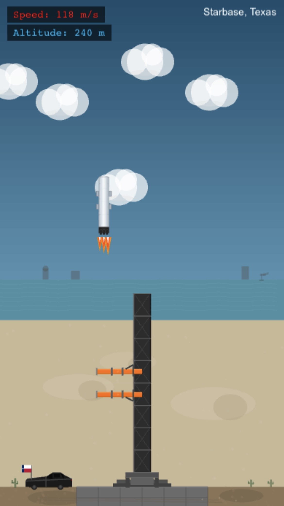

# 🚀 Catch Starship - Rocket Landing Game

A 2D browser-based game built with Phaser 3 where you control a descending Starship booster and must successfully land it between Mechazilla's chopstick arms. Land at different locations including Starbase, Texas and Mars!

## 🎮 Play Online

**[Play the game now at catch-starship.vercel.app](https://catch-starship.vercel.app)**

## 📸 Screenshots



## ✨ Features

- **Responsive Design**: Works on desktop and mobile devices
- **Multiple Landing Locations**: Land in Starbase, Texas and Mars, each with unique visuals
- **Realistic Physics**: Control the Starship's descent with gravity and engine thrust

## 🎯 How to Play

1. **Start**: Press SPACE on the menu screen to begin
2. **Controls**:
   - **LEFT ARROW**: Move starship left
   - **RIGHT ARROW**: Move starship right
   - **SPACE**: Fire engines to slow descent
3. **Objective**: Land the Starship between Mechazilla's chopstick arms
4. **Win Conditions**:
   - Land within the catch zone (between the orange arms)
   - Vertical landing speed < 180 m/sec
5. **Restart**: Press SPACE on the game over screen to try again

## 🛠️ Technology Stack

- **[Phaser 3](https://phaser.io/)** (v3.90.0) - Game framework with built-in physics
- **[Webpack](https://webpack.js.org/)** - Module bundler and development server
- **Arcade Physics** - Lightweight 2D physics engine
- **ES Modules** - Modern JavaScript module system
- **[Vercel](https://vercel.com/)** - Deployment and hosting
- **[Vercel Analytics](https://vercel.com/analytics)** - Usage analytics

## 📋 Prerequisites

- **Node.js** (v14 or higher)
- **npm** (comes with Node.js)

## 🚀 Local Development Setup

### 1. Install Dependencies

```bash
npm install
```

All dependencies are installed locally to this project in `node_modules/`.

### 2. Run Development Server

```bash
npm run dev
```

This will:
- Start the Webpack dev server at http://localhost:8080
- Automatically open your browser
- Enable hot module reloading (changes update instantly)

### 3. Build for Production

```bash
npm run build
```

This creates an optimized production bundle in the `dist/` folder.

## 📦 Available Scripts

- **`npm run dev`** - Start development server with hot reload
- **`npm run build`** - Create production build in `dist/`
- **`npm run start`** - Alternative to `npm run dev`
- **`npm run lint`** - Check code for linting errors
- **`npm run lint:fix`** - Automatically fix linting errors
- **`npm run format`** - Format all code with Prettier
- **`npm run format:check`** - Check if code is properly formatted

## 🔍 Code Quality

This project uses modern JavaScript best practices with automated code quality tools:

### ESLint

- **Version**: ESLint 9 with flat config system
- **Configuration**: `eslint.config.js`
- **Rules**: Enforces consistent code style, no unused variables, proper error handling
- **Run**: `npm run lint` or `npm run lint:fix`

### Prettier

- **Configuration**: `.prettierrc`
- **Style**: Single quotes, 2-space indentation, 100 character line width
- **Run**: `npm run format` or `npm run format:check`

### ES Modules

- All source code uses modern ES module syntax
- Explicit `.js` extensions required for imports
- Webpack config uses CommonJS (`.cjs`) for compatibility

## 🌐 Deployment

This project is deployed on **Vercel** for automatic continuous deployment.

### Deploy Your Own

1. **Fork/Clone** this repository
2. **Sign up** for a free [Vercel account](https://vercel.com/signup)
3. **Import** your repository in Vercel dashboard
4. **Configure**:
   - Framework Preset: Other
   - Build Command: `npm run build`
   - Output Directory: `dist`
5. **Deploy** - Vercel will automatically deploy on every push to main branch

### Manual Deployment

```bash
# Install Vercel CLI globally (one-time)
npm install -g vercel

# Deploy to Vercel
vercel --prod
```

## 📁 Project Structure

```
catch-starship/
├── src/
│   ├── index.html              # HTML entry point
│   ├── main.js                 # Phaser game configuration
│   ├── config/
│   │   └── constants.js        # Game constants (physics, colors, sizes)
│   ├── scenes/
│   │   ├── PreloadScene.js     # Asset loading with progress bar
│   │   ├── MenuScene.js        # Start menu with location selection
│   │   ├── GameScene.js        # Main gameplay and physics
│   │   └── GameOverScene.js    # Results screen
│   ├── gameobjects/
│   │   ├── Starship.js         # Starship with physics and flames
│   │   └── Mechazilla.js       # Mechazilla tower with catch zone
│   ├── utils/
│   │   └── helpers.js          # Utility functions
│   └── assets/
│       └── images/
│           └── starship.svg    # Starship vector graphic
├── screenshots/                 # Game screenshots
├── dist/                       # Production build output (generated)
├── node_modules/               # Dependencies (generated)
├── webpack.config.cjs          # Webpack bundler configuration
├── eslint.config.js            # ESLint linting rules
├── .prettierrc                 # Prettier formatting rules
├── package.json                # Project dependencies and scripts
└── README.md                   # This file
```

## 🤝 Contributing

Contributions are welcome! Feel free to:

- Report bugs
- Suggest new features
- Submit pull requests
- Improve documentation

## 📝 License

MIT

## 🙏 Credits

- Built with [Phaser 3](https://phaser.io/)
- Inspired by SpaceX's Starship and Mechazilla catching system
- Deployed on [Vercel](https://vercel.com/)

---
